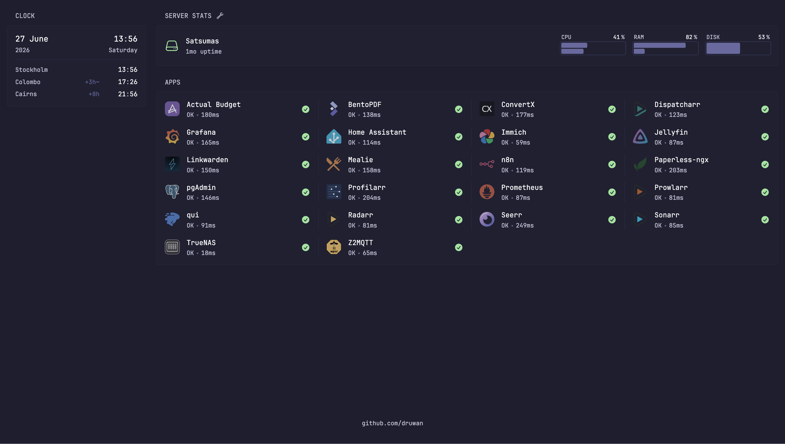

# Homelab

A Kubernetes-based homelab built with GitOps practices.



---

## Hardware

| Device | Spec | Role |
| ------ | ---- | ---- |
| GMKtec G3 Plus | Intel Twin Lake N150 · 16GB RAM · 512GB SSD · Arch Linux |  k3s cluster |
| Ugreen NAS DXP4800 Plus | 4x Seagate IronWolf Pro 8 TB · 64GB DDR5 RAM · 2TB NMVe Cache | Storage |
| Raspberry Pi 5 | 8GB RAM | Pi-hole + Unbound |

---

## Stack

| Layer | Tool |
| ---- | ---- |
| Orchestration | k3s |
| GitOps | Flux |
| Ingress | Traefik |
| Certificates | cert-manager + Cloudflare DNS01 |
| Secrets | External Secrets Operator → Azure Key Vault |
| Encryption | SOPS + age |
| Databases | CloudNativePG (PostgreSQL + PostGIS) |
| Dependency Updates | Renovate Mend |
| Monitoring | Kube Prometheus Stack (Prometheus + Grafana) |

---

## Bootstrapping

``` bash
 # Uninstall k3s
 /usr/local/bin/k3s-killall.sh
 /usr/local/bin/k3s-uninstall.sh

 # Reinstall
 sudo curl -sfL <https://get.k3s.io> | sh -s - --disable-helm-controller --data-dir=/home/k3s

 # Copy kubeconfig and update server address
 sudo cp /etc/rancher/k3s/k3s.yaml ~/.kube/config

 # Bootstrap Flux
 flux bootstrap github --owner=druwan --repository=homelab --branch=main --path=./clusters/staging --personal

 # SOPS age key
 k create secret generic sops-age --namespace=flux-system --from-file=age.agekey=./age.agekey --dry-run -o yaml | k apply -f -

 # External Secrets
 k apply -k infrastructure/controllers/staging/external-secrets
 k create secret generic azure-creds \
   --from-literal=clientId=${AZURE_KEY_VAULT_CLIENT_ID} \
   --from-literal=clientSecret=${AZURE_KEY_VAULT_CLIENT_VALUE} \
   -n external-secrets

 # cert-manager namespace
 k create namespace cert-manager
 ```
